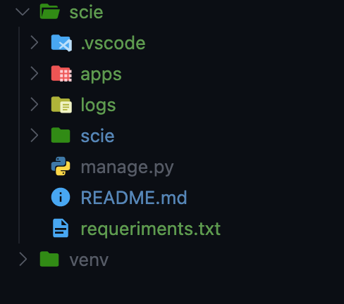

# Back End for sci

### Tree directory example
</img>
#
### Create a virtual enviroment using python 3.7
```bash
pip install virtualenv
#or
pip3 install virtualenv
#or
pip3.7 install virtualenv
# next
virtualenv venv
```

### Start virtual enviroment
```bash
path/to/venv/Scripts/activate.bat
```
## Setup project
### Run the following commands inside the project directory
#
### Install requeriments
```bash
pip install -r requeriments.txt
```

### Make database
```bash
python manage.py makemigrations
```
```bash
python manage.py makemigrations users
```
```bash
python manage.py migrate
```
```bash
python manage.py migrate users
```
### Make a superadmin
```bash
python manage.py createsuperuser --username <username>
#Follow the instructions
```
